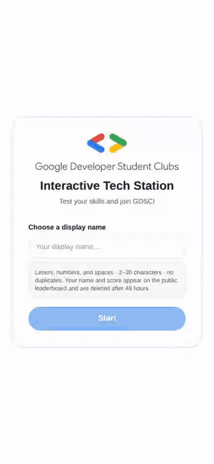
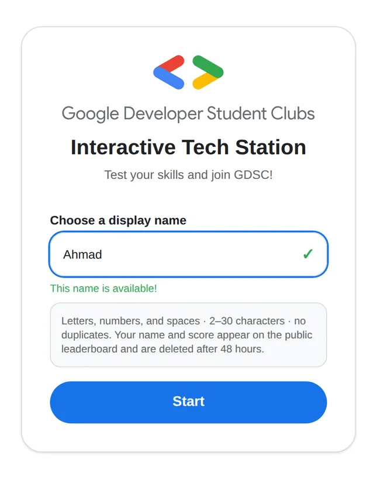
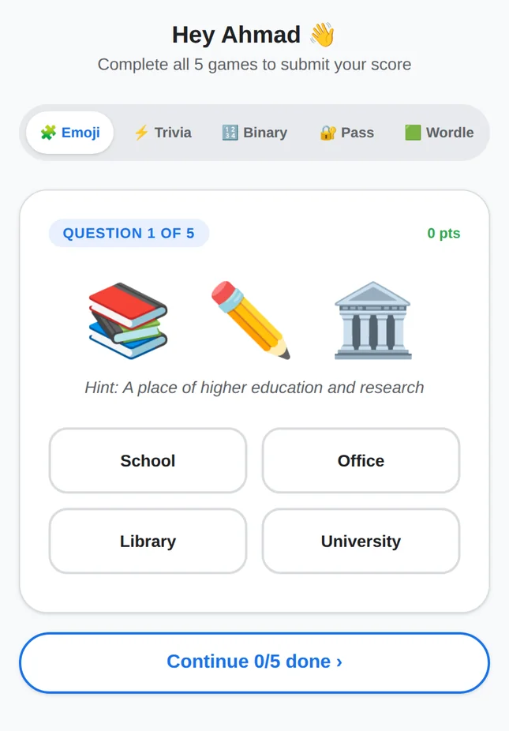
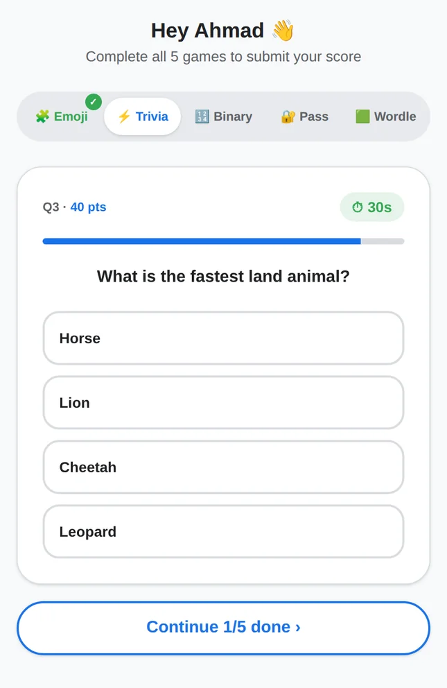
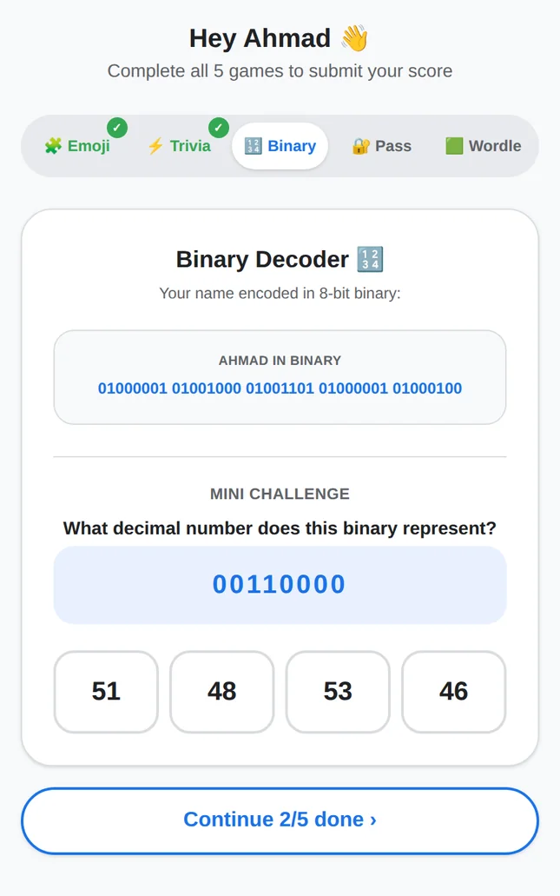
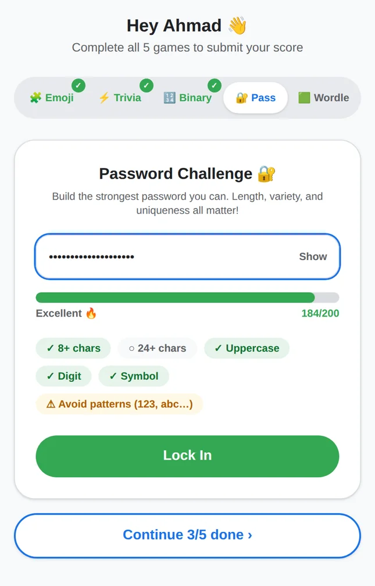
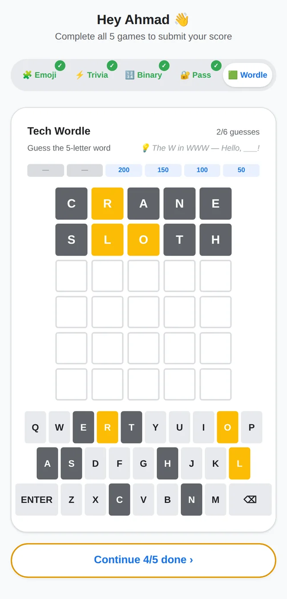
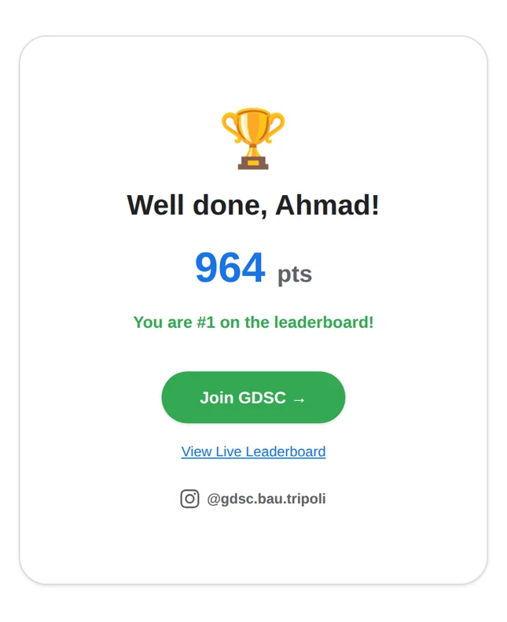
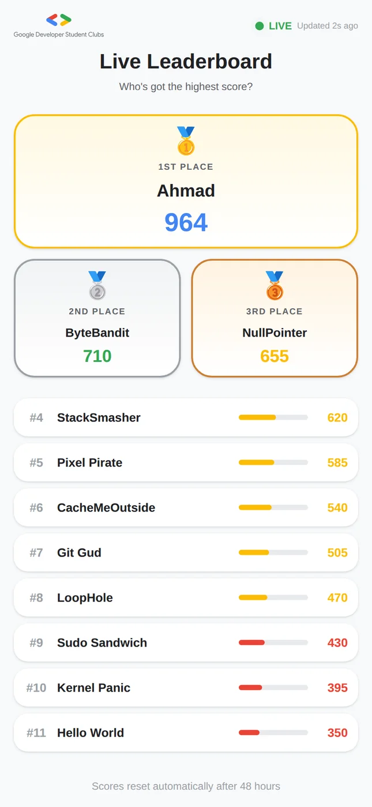
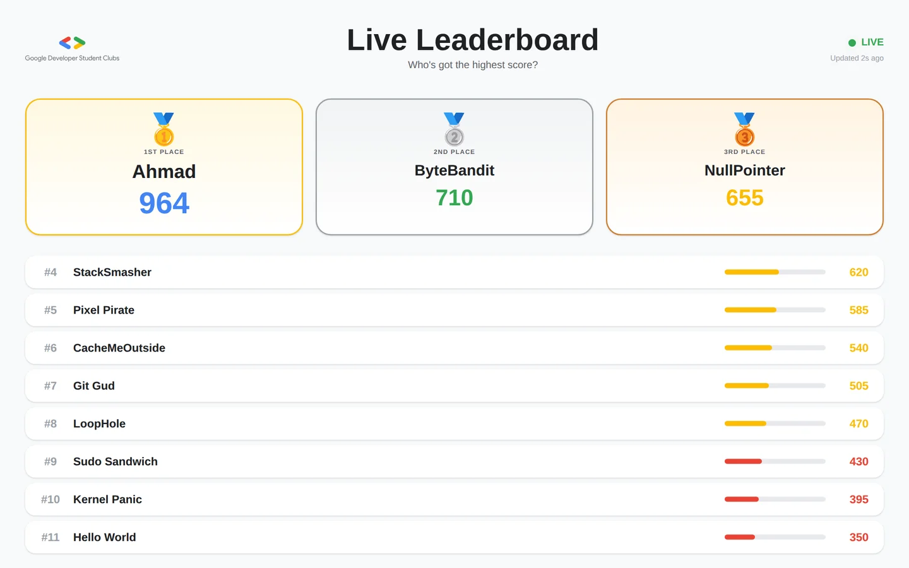

# GDSC Booth: Interactive Tech Station

The booth app for **Google Developer Groups on Campus, Beirut Arab University, Tripoli Campus** at the Fall 2026 club fair. Students walk up to a device, enter a display name, play five short tech mini-games and land on a live leaderboard. A second screen at the booth shows the leaderboard updating in real time, and the finish screen links to the chapter sign-up form.

**50 students played it at the club fair.** It was designed, built and deployed in three days.

> **Status:** ran live at the club fair in September 2026 and is now offline. The screenshots and video below come from a local run of the same code, with sample names on the leaderboard.

<p align="center">
  
</p>
<p align="center"><sub>Full playthrough, sped up 2×. <a href="docs/screenshots/playthrough.mp4">Watch it at normal speed (MP4, 1:25)</a>.</sub></p>

## Screenshots

| Name entry | Emoji Riddles | Tech Trivia |
|---|---|---|
|  |  |  |

| Binary Decoder | Password Challenge | Wordle |
|---|---|---|
|  |  |  |

| Finish | Leaderboard (phone) |
|---|---|
|  |  |

**Booth second screen:**



## The games

| Game | What you do |
|---|---|
| Emoji Riddles | Work out the tech term or everyday word hidden in a row of emoji |
| Tech Trivia | 35-second speed round of tech and general trivia; wrong answers cost points |
| Binary Decoder | Turn a binary number into decimal (1–99) |
| Password Challenge | Build the strongest password you can, scored live |
| Wordle | Guess a five-letter tech word in six tries, with a hint after two guesses |

Each player gets a fresh random set of questions, with answer options shuffled (Fisher–Yates) so the right answer isn't always in the same spot.

## Keeping the leaderboard honest

A public leaderboard at a fair is an open invitation to cheat, so the client is never trusted with a score.

- **Encrypted sessions.** Entering a name calls `POST /api/session`, which picks the player's questions and seals them, with the name and a timestamp, into an AES-256-GCM token. The browser can't swap in easier questions or change the name it plays under.
- **Server-side scoring.** `POST /api/score` accepts raw answers only. The server decrypts the token, grades each answer against the question pools and calculates the total itself.
- **One run per player.** Each session can submit only once, claimed with a Firebase transaction, so replays and parallel submissions fail with `409`. Every submission also carries an ID, so a retried request returns the same result instead of adding a second entry.
- **A minimum play time.** Scores sent within 45 seconds of starting are rejected, and tokens expire after 30 minutes.
- **Unique names.** A display name is reserved for the day, so nobody can pose as another player.
- **Locked-down headers.** A Content-Security-Policy limits scripts and connections to the app and Firebase.

**Known limitation:** the games show instant right/wrong feedback, so the session response includes the correct answers. A player who opens the browser dev tools could read them and get a perfect run. They still can't post a score above the real maximum, play twice, or submit someone else's run. Grading each answer on the server as it's given would close this gap; for a one-day booth, instant feedback mattered more.

## Privacy

- Players give only a display name, and a consent notice on the entry screen says it will appear publicly.
- Every record is written with an `expiresAt` timestamp 48 hours out. A daily Vercel cron job (`/api/cron/cleanup`, protected by `CRON_SECRET`) deletes anything past it.
- No IP addresses or other identifiers are stored.

## Stack

Next.js 16 (App Router) · React 19 · TypeScript · Tailwind CSS 4 · Firebase Realtime Database (Admin SDK on the server) · Vercel (hosting and cron) · Jest and React Testing Library

```
app/
  page.tsx               name entry and consent
  play/page.tsx          game hub (tabs, completion state, submit)
  leaderboard/page.tsx   live leaderboard for the booth screen
  api/session            issues encrypted session tokens
  api/score              validates answers and scores server-side
  api/names/check        display-name availability
  api/leaderboard        leaderboard read via the Admin SDK
  api/cron/cleanup       deletes expired records
components/games/        the five mini-games
lib/                     session crypto, scoring, question pools, Firebase
__tests__/               unit, component and API route tests
```

## Running locally

```bash
npm install
cp .env.example .env.local   # then fill in the values below
npm run dev
```

| Variable | Purpose |
|---|---|
| `SESSION_SECRET` | Key material for the AES-256-GCM session tokens |
| `FIREBASE_PROJECT_ID`, `FIREBASE_CLIENT_EMAIL`, `FIREBASE_PRIVATE_KEY` | Firebase Admin SDK service account |
| `NEXT_PUBLIC_FIREBASE_API_KEY`, `NEXT_PUBLIC_FIREBASE_AUTH_DOMAIN`, `NEXT_PUBLIC_FIREBASE_DATABASE_URL`, `NEXT_PUBLIC_FIREBASE_PROJECT_ID` | Firebase client config |
| `CRON_SECRET` | Bearer token Vercel sends to the cleanup cron |

```bash
npm test        # Jest
npm run lint
npm run build
```

The design spec and implementation plan are in [`docs/superpowers/`](docs/superpowers/).

## Author

Built by [Ahmad Nasser](https://ahmadnasserx.com), Tech Lead, GDG on Campus BAU Tripoli.
